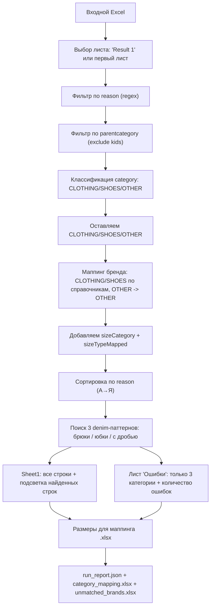

# Oskelly Size Mapping

Скрипт обрабатывает входной Excel с ошибками размеров и оставляет только строки,
где действительно нужно проставить `Size type` по справочникам брендов.

## Что делает

1. Читает входной Excel (по умолчанию лист `Result 1`).
2. Оставляет строки, где `reason` **начинается** с:
   - `Для категории '...' не найден тип размера`
   - `не найден размер`
3. По `parentcategory`:
   - исключает детские значения (`Kids`, `Boy`, `Girl`, `Детское`, `Девочки`, `Мальчики`);
   - все остальные группы пропускает.
4. Берёт уникальные `category` и классифицирует их в `CLOTHING | SHOES | OTHER`
   (через LLM или heuristic fallback).
5. Оставляет `CLOTHING`, `SHOES` и `OTHER`.
6. Для строк `CLOTHING/SHOES` ищет бренд в нужном справочнике:
   - `CLOTHING` -> `Справочник одежда.xlsx`
   - `SHOES` -> `Справочник обувь.xlsx`
   Для `OTHER` ставит `sizeTypeMapped = OTHER`.
7. Добавляет в итог:
   - `sizeCategory` (что определилось: `CLOTHING` / `SHOES` / `OTHER`),
   - `sizeTypeMapped` (`sizetype` из справочника для `CLOTHING/SHOES`, либо `OTHER`).
8. Пишет результат и отчёты в `output/<input_stem> <dd.mm.yyyy> vN/`.

## Блок-схема



## Установка

```bash
python3 -m venv .venv
source .venv/bin/activate
pip install -r requirements.txt
```

## Запуск

### Обычный (с LLM, только `--input`)

```bash
export OPENAI_API_KEY="..."
python3 main.py \
  --input "cuccini.xlsx" \
  --email "cuccuinioskelly@gmail.com"
```

Скрипт сам ищет справочники `Справочник одежда.xlsx` и `Справочник обувь.xlsx`
в таком порядке:
1) рядом с `main.py`
2) рядом с входным файлом `--input`
3) по пути из текущей директории

### Без LLM (heuristic only)

```bash
python3 main.py \
  --input "/Users/petr/Downloads/Пример файла с ошибками.xlsx" \
  --email "cuccuinioskelly@gmail.com" \
  --dry-run
```

Если нужно, пути к справочникам можно переопределить:

```bash
python3 main.py \
  --input "cuccini.xlsx" \
  --email "cuccuinioskelly@gmail.com" \
  --clothing-dict "/path/Справочник одежда.xlsx" \
  --shoes-dict "/path/Справочник обувь.xlsx"
```

## Выходные файлы

- `Размеры для маппинга <email> <dd.mm.yyyy>.xlsx` (если `--email` не передан, используется `<input_stem>`) — итоговый файл
- `category_mapping.xlsx` — как классифицировались уникальные категории
- `unmatched_brands.xlsx` — бренды без найденного `sizetype` (если есть)
- `run_report.json` — статистика обработки

## Конфиг

Все правила в `config.yml`:
- regex по началу строки `reason`,
- include/exclude маркеры `parentcategory`,
- LLM модель и параметры,
- keyword fallback,
- названия выходных колонок.
